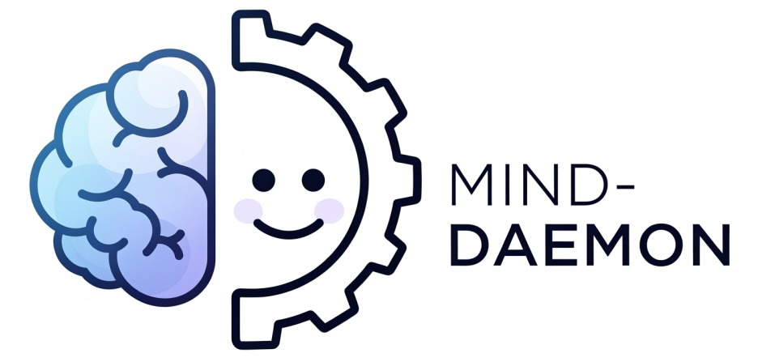

<div align="center">
  
</div>

# Mind Daemon - BCI智能辅助系统

🧠 **基于脑机接口(BCI)的专注力和生产力辅助系统，专为ADHD患者设计**

Mind Daemon 通过 Emotiv BCI 设备监测用户的认知状态，并通过智能环境控制提供自动化辅助，帮助用户维持专注、减少分心、优化工作状态。

## ✨ 核心功能

- **🧠 实时BCI监测**: 使用Emotiv头戴设备监测脑电信号
- **📊 认知状态分析**: AI分析专注度、压力、疲劳、放松等状态  
- **🎵 智能音乐控制**: 根据状态自动切换专注/放松音乐
- **💡 环境光控制**: 智能调节灯光颜色和亮度
- **🌈 屏幕光晕提醒**: 柔和的视觉提醒和状态指示
- **📱 实时Dashboard**: Web界面显示所有数据和状态
- **🤖 MiniMax AI决策**: 基于LLM的智能干预建议

## 🚀 快速开始

### 1. 环境准备

```bash
# 安装uv包管理器
curl -LsSf https://astral.sh/uv/install.sh | sh

# 同步项目依赖
uv sync
```

### 2. 启动系统

```bash
# 启动Mind Daemon主程序
uv run mind-daemon
```

### 3. 打开前端监控

```bash
# 在浏览器中打开前端Dashboard
open dashboard/index.html
# 或直接访问文件路径：file:///path/to/Mind-Daemon/dashboard/index.html
```

### 工作流程

1. **目标设定**: 用户设定专注目标和预计完成时间
2. **实时监测**: BCI设备实时检测用户专注程度和认知状态  
3. **智能决策**: AI Agent根据认知状态做出环境调节决策
4. **自动调节**: 系统自动控制光晕效果、背景音乐等环境因素
5. **状态切换**: 在专注、放松、心流等状态间智能切换

### 状态转换逻辑

- **低专注 → 放松模式**: 播放放松音乐，显示舒缓光晕
- **准备专注**: 手势控制进入专注准备，播放背景音乐
- **高专注 → 心流状态**: 逐渐降低音乐音量，逐渐降低光晕亮度至0，减少干扰
- **认知过载**: 停止音乐，显示警示光晕

## 🧠 系统架构

### 模块结构

```
Mind-Daemon/
├── src/mind_daemon/          # 主要源代码
│   ├── agent/               # 智能Agent系统
│   │   ├── intelligent_agent.py    # MiniMax LLM驱动的智能决策
│   │   ├── control_center.py       # 中央控制协调
│   │   ├── state_manager.py        # 状态管理
│   │   └── bci_interface.py        # BCI-Agent通信接口
│   ├── bci/                 # 脑机接口处理
│   │   ├── state_analyzer.py       # 实时认知状态分析
│   │   ├── csv_logger.py           # BCI数据记录
│   │   └── cortex.py               # Emotiv Cortex API
│   ├── peripheral/          # 外设控制
│   │   ├── halo_controller.py      # 屏幕光晕效果
│   │   ├── halo.py                 # PyQt6光晕实现
│   │   └── music_player.py         # 智能音乐播放
│   └── detect/              # 手势检测
│       ├── config.py               # 连接到开发板的配置文件
│       ├── gesture_detector.py     # 控制开发板上的ros服务和socket服务
│       └── socket_client.py        # 通过socket获取开发板上检测到的手势识别数据
├── dashboard/               # 前端监控界面
│   ├── index.html          # 主监控页面
│   ├── css/                # 样式文件
│   └── js/                 # JavaScript逻辑
├── music/                   # 背景音乐文件
│   ├── focus/              # 专注音乐
│   └── relax/              # 放松音乐
├── docs/                    # 文档
└── tests/                   # 测试用例
```

### 核心模块功能

#### 1. Agent模块 (`src/mind_daemon/agent/`)
- **智能决策**: 基于MiniMax LLM的智能环境调节策略
- **状态管理**: 用户认知状态和系统状态的统一管理
- **控制协调**: 各个子系统间的协调控制

#### 2. BCI模块 (`src/mind_daemon/bci/`)
- **Cortex API**: Emotiv设备的WebSocket通信接口
- **状态分析**: 实时脑电信号的认知状态识别
- **数据记录**: CSV格式的完整数据记录

#### 3. 外设模块 (`src/mind_daemon/peripheral/`)
- **屏幕光晕**: 基于认知状态的视觉反馈
- **智能音乐**: 根据专注水平自动调节的背景音乐

#### 4. 手势识别模块 (`src/mind_daemon/detect/`)
- **控制开发板服务**: 利用控制脚本实现封装完好的开发板上ros的手势识别服务与socket服务控制功能
- **数据通信**: 通过socket将手势识别的数据传递给Agent模块

## 💻 系统要求

**基础要求:**
- Python 3.12+
- macOS/Linux/Windows
- 2GB+ 可用内存

**硬件设备:**
- **Emotiv BCI设备** (EPOC/Insight) - 可选，支持开发模式
- **D-Robotics RDK X5开发板** - 用于手势识别 (可选)

**软件依赖:**
- **uv包管理器** - Python依赖管理
- **PyQt6** - 光晕效果 (可选)
- **现代浏览器** - 用于Dashboard监控界面

## 🎛️ 外设控制功能

### 光晕效果映射

| 认知状态 | 光晕颜色 | 视觉效果 | 含义 |
|---------|---------|----------|------|
| 高专注 | 🟢 绿色 | 稳定发光 | 保持心流状态 |
| 中等专注 | 🟡 黄色 | 柔和呼吸 | 专注进行中 |
| 低专注 | 🟠 橙色 | 提醒闪烁 | 注意力分散 |
| 放松 | 🔵 青色 | 舒缓呼吸 | 休息状态 |
| 困倦 | 🟣 紫色 | 慢速脉冲 | 需要休息 |
| 认知过载 | 🔴 红色 | 快速闪烁 | 降低负荷 |
| 中性 | 🔵 蓝色 | 默认发光 | 基线状态 |

### 音乐播放策略

- **专注状态**: 播放专注音乐，高专注时逐渐减音量
- **放松状态**: 播放舒缓音乐，适中音量
- **认知过载**: 停止音乐播放，减少干扰
- **低专注**: 轻柔背景音乐，较低音量

## 📊 数据记录与分析

### CSV数据记录
- **实时记录**: EEG通道数据、性能指标、认知状态
- **事件标记**: 会话开始/结束、状态变化、用户操作
- **完整元数据**: 时间戳、用户ID、会话信息

### 数据格式
```csv
timestamp,datetime_str,cognitive_state,confidence,attention_current,
engagement_score,relaxation_score,AF3,F7,F3,FC5,T7,P7,O1,O2,P8,T8,
FC6,F4,F8,AF4,session_id,user_id,notes
```

## 🔧 硬件要求

### BCI设备
- **Emotiv EPOC/Insight**: 官方支持的EEG头戴设备
- **Emotiv Launcher**: 必须运行的配套软件
- **设备凭证**: 需要Emotiv开发者账号的Client ID/Secret

### 开发板
- **D-Robotics RDK X5**: 由地瓜机器人提供的开发板
- **USB/MIPI 摄像头**: 用于拍摄获取用户当前手势

### 系统要求
- **操作系统**: macOS, Windows, Linux
- **Python**: 3.8+ (推荐3.12)
- **内存**: 至少2GB可用内存
- **显示**: 支持图形界面 (光晕效果)

### 可选组件
- **PyQt6**: 光晕效果支持
- **MiniMax API**: 智能决策增强
- **音频输出**: 音乐播放功能

## 🚀 部署指南

### 基础部署
```bash
git clone <repository-url>
cd Mind-Daemon
```

**安装依赖:**
```bash
uv sync
```

**配置说明:**
项目已包含基础配置文件，默认启用开发模式。如需自定义：

```bash
# 1. 可选：安装额外依赖
uv add PyQt6  # 用于光晕效果

# 2. 可选：配置环境变量 
# 编辑 .env 文件，配置以下信息:
# - EMOTIV_CLIENT_ID: 从 emotiv.com 开发者账户获取
# - EMOTIV_CLIENT_SECRET: 从 emotiv.com 开发者账户获取 
# - RDK_HOST: 开发板地址 (如: 192.168.1.100)
# - MINIMAX_API_KEY: 从 api.minimax.chat 获取 (可选)

# 3. 可选：配置Emotiv设备
# - 安装EMOTIV Launcher
# - 连接设备或创建虚拟设备
```

### 3. 配置说明

在 `.env` 文件中配置以下关键参数:

```bash
# BCI设备配置 (如有Emotiv设备)
EMOTIV_CLIENT_ID=your_client_id
EMOTIV_CLIENT_SECRET=your_client_secret

# MiniMax LLM API配置 (用于智能决策)
# 在 https://api.minimaxi.com 获取API密钥 (JWT token格式)
MINIMAX_API_KEY=your_minimax_api_key_here
MINIMAX_GROUP_ID=your_group_id_here
MINIMAX_MODEL=MiniMax-Text-01

# 开发模式 (无BCI设备时启用)
DEV_MODE=true

# 系统路径 (使用项目相对路径)
MUSIC_DIR=music
WINDOW_PY_PATH=src/mind_daemon/peripheral/window.py
```

### 4. MiniMax API配置

系统使用MiniMax API进行智能决策，需要正确配置API密钥：

**获取MiniMax API密钥：**
1. 访问 [MiniMax AI开放平台](https://api.minimaxi.com)
2. 注册账户并完成实名认证
3. 在 `账户管理 > 接口密钥` 中创建API密钥
4. 复制API密钥（JWT格式，以`eyJhbGciOiJSUzI1NiI`开头）

**支持的模型：**
- `MiniMax-M1`: 推理模型，输出token较多，建议流式输出
- `MiniMax-Text-01`: 文本模型，适合结构化输出（推荐）

**API测试：**
```bash
# 测试MiniMax API连接
python test_minimax_api.py
```

### 5. 系统健康检查

在启动系统前，建议运行健康检查确保所有组件正常：

```bash
# 运行完整的系统健康检查
uv run python -m mind_daemon.utils.health_check

- [BCI外设使用指南](docs/BCI_外设使用指南.md)
- [Cortex API使用文档](docs/CortexAPI_使用文档.md)
- [RDK开发者手册](https://d-robotics.github.io/rdk_doc/RDK)
- [项目介绍](docs/intro.md)
- [演示指南](docs/DEMO_GUIDE.md)

# 生成JSON格式报告
uv run python -m mind_daemon.utils.health_check --json
```

### 已完成功能 ✅
- [x] 实时BCI数据处理
- [x] 多种认知状态识别
- [x] 智能Agent决策引擎
- [] 屏幕光晕效果控制
- [x] 智能音乐播放系统
- [x] 完整CSV数据记录
- [x] 多模态演示系统
- [x] 手势检测集成

## 🚀 运行系统

### 启动步骤

1. **启动主程序:**
```bash
uv run mind-daemon
```

2. **打开前端监控:**
```bash
# 在浏览器中打开Dashboard
open dashboard/index.html

# 或直接访问文件路径
# file:///path/to/Mind-Daemon/dashboard/index.html
```

### 系统状态

程序启动后会显示:
- 🌐 WebSocket服务器运行在 `ws://localhost:8889`
- 🧠 BCI数据处理服务已启动
- 🎛️ 环境控制服务已就绪
- 📊 前端Dashboard可通过浏览器访问

## 📱 前端监控Dashboard

### 界面功能

**Dashboard主要功能:**
- 🧠 **实时认知状态监控** - 显示当前专注度、放松度、压力等指标
- 💡 **环境控制状态** - 实时显示光晕颜色、音乐播放状态
- 📊 **数据可视化图表** - 认知状态的历史趋势和变化曲线
- 🤖 **AI决策摘要** - MiniMax Agent的智能决策和建议
- ⚡ **系统操作记录** - 环境调节动作的实时记录

### 访问方式

```bash
# 方式1: 命令行打开
open dashboard/index.html

# 方式2: 浏览器直接访问
# 将以下路径粘贴到浏览器地址栏:
# file:///你的项目路径/Mind-Daemon/dashboard/index.html
```

### 数据通信协议

**WebSocket连接:** `ws://localhost:8889`

**数据格式:**
```javascript
{
  "basic": {
    "light": {
      "is_on": true,
      "color_hex": "#FF5733", 
      "lightness": 75
    },
    "music": {
      "is_playing": true,
      "name": "专注音乐",
      "type": "Focus"
    },
    "Scores": {
      "At": 68,  // 专注度 (0-100)
      "Ex": 45,  // 兴奋度 (0-100) 
      "Re": 72,  // 放松度 (0-100)
      "St": 35   // 压力值 (0-100)
    }
  },
  "advanced": {
    "State": "Focused",           // 当前认知状态
    "Summary": "用户专注度较高，系统正在维持当前环境配置", 
    "Action": "保持专注音乐，调节光晕为绿色"
  }
}
```

## 🔧 开发模式

当没有BCI设备时，系统会自动启用开发模式，使用模拟数据:

**开发模式特性:**
- 📈 自动生成模拟BCI数据
- 🎲 随机认知状态变化
- 🔄 完整系统功能测试
- 📱 前端Dashboard正常工作

**手动启用:**
```bash
# 在.env文件中设置
echo "DEV_MODE=true" >> .env
```

## 🧪 测试验证

### 基础测试

```bash
# 1. 启动系统
uv run mind-daemon

# 2. 在新终端打开Dashboard
open dashboard/index.html

# 3. 检查WebSocket连接
# 浏览器开发者工具 -> Network -> WS -> 查看连接状态
```

### 功能验证

**验证检查点:**
- ✅ WebSocket连接成功 (`ws://localhost:8889`)
- ✅ 认知状态数据实时更新
- ✅ 光晕颜色随状态变化
- ✅ 音乐播放状态显示
- ✅ AI决策摘要正常显示

## 🎵 音乐系统

**音乐目录结构:**
```
music/
├── focus/      # 专注音乐 (古典、器乐)
└── relax/      # 放松音乐 (环境音、慢节奏)
```

**支持格式:** `.mp3`, `.wav`, `.m4a`, `.flac`

**自动播放逻辑:**
- 🧠 检测到压力 → 自动切换放松音乐
- 🎯 检测到分心 → 自动切换专注音乐  
- 🔄 连续播放，智能选曲避重复
- 🔇 60秒切换冷却时间

## 💡 光晕系统

屏幕边缘光晕效果用于:
- 🔴 压力提醒 (红色/橙色)
- 🔵 专注辅助 (蓝色)
- 🟢 放松指示 (绿色)
- 🟡 注意力提醒 (黄色)

**控制逻辑:**
- 30秒激活冷却时间
- 15秒颜色变化冷却时间
- 心理学颜色原理指导

**光晕测试:**
```bash
# 交互式光晕测试
python test_halo_effects.py

# 快速颜色序列测试
python test_halo_effects.py sequence

# 压力场景测试
python test_halo_effects.py stress

# 专注场景测试
python test_halo_effects.py focus

# 放松场景测试
python test_halo_effects.py relax

# 完整测试套件
python test_halo_effects.py all
```

**支持的光晕颜色:**
- 基础颜色：红、绿、蓝、紫、橙、粉、黄、青、白
- 情境颜色：暖白、冷蓝、柔绿、夕阳橙、薰衣草、薄荷绿

## 🤖 AI智能决策

**决策流程:**
1. **BCI数据采集** → 实时脑电信号
2. **状态分析** → 传统算法 + AI分析
3. **阈值判断** → 触发条件检测
4. **MiniMax决策** → LLM生成干预策略
5. **环境控制** → 执行具体调节动作

**支持的状态:**
- 🎯 `FOCUSED` - 专注状态
- 😌 `RELAXED` - 放松状态  
- 😰 `STRESSED` - 压力状态
- 😴 `FATIGUED` - 疲劳状态
- 😵 `DISTRACTED` - 分心状态

## 📱 Dashboard功能

**实时监控面板包含:**

1. **基础数据标签页:**
   - 💡 灯光状态和控制
   - 🎵 音乐播放状态
   - 🪟 窗帘状态
   - 📊 认知分数实时图表

2. **高级分析标签页:**
   - 🧠 当前精神状态
   - 📝 AI生成的状态摘要
   - ⚡ 系统执行的动作
   - 📈 历史趋势分析

3. **实时数据流:**
   - 🔄 每秒更新数据
   - 📈 动态图表显示
   - 🎨 状态颜色编码
   - ⏰ 时间戳显示

## 🔧 故障排除

### 常见问题解决

**1. 系统无法启动**
```bash
# 检查依赖安装
uv sync

# 重新启动
uv run mind-daemon
```

**2. Dashboard无法连接**
```bash
# 检查端口占用
lsof -i :8889

# 确认WebSocket服务正常运行
# 浏览器开发者工具 -> Console 查看错误信息
```

**3. BCI设备问题**
- 确保 Emotiv Launcher 运行中
- 检查设备连接和权限
- 可启用开发模式: `DEV_MODE=true`

**4. 前端显示异常**
- 清除浏览器缓存
- 确认 `dashboard/index.html` 路径正确
- 检查浏览器控制台错误信息

## 🔒 隐私与安全

- 🔐 所有BCI数据本地处理，不上传云端
- 🔑 API密钥安全存储在.env文件中
- 📊 可选择关闭数据记录功能
- 🏠 完全离线运行（除LLM API调用外）

## 🤝 贡献指南

1. Fork 项目
2. 创建功能分支: `git checkout -b feature/new-feature`
3. 提交更改: `git commit -m 'Add new feature'`
4. 推送分支: `git push origin feature/new-feature`
5. 提交Pull Request

## 📄 许可证

本项目采用 MIT 许可证 - 查看 [LICENSE](LICENSE) 文件了解详情。

## 🙏 感谢

- Emotiv公司提供的BCI技术支持
- 地瓜机器人公司提供的RDK X5开发板支持
- MiniMax团队的LLM服务
- PyQt6团队的UI框架
- 所有贡献者和测试用户

## 📭 联系我们
- 📧 Email: aster@hdu.edu.cn
- 🐛 Issues: [GitHub Issues](https://github.com/your-repo/issues)

---

**Mind Daemon - 让AI成为你专注力的守护者** 🧠✨